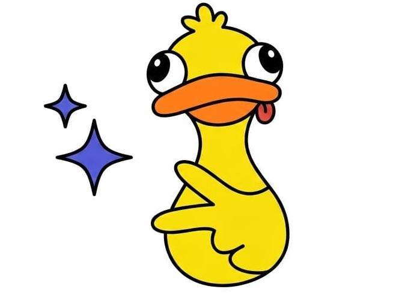

<!-- Banner -->

<!-- Snoopy a la izquierda -->

 
<h2>Holi Soy Liss :) </h2>
¡Bienvenido a mi pequeño espacio en el mundo de git! Soy estudiante de TI y me gusta aprender cosas nuevas cada día, escuchar música mientras programo y encontrar el equilibrio entre la lógica del software y la creatividad.
 

---
---
### Lenguajes y Herramientas
<table>
  <tr>
    <td>
      <ul>
        <li><b>C:</b> Tengo bases sólidas en programación estructurada.</li>
        <li><b>Java:</b> Manejo desarrollo orientado a objetos.</li>
        <li><b>Bases de Datos:</b> Experiencia en consultas y gestión de datos.</li>
      </ul>
    </td>
    <td>
      
    </td>
  </tr>
</table>

---
### En lo que estoy trabajando
<table>
  <tr>
    <td>
      Ahora mismo estoy desarrollando <b>Ring-CARDS!!</b>, una herramienta para organizar recordatorios de pagos financieros, buscando que la tecnología nos facilite un poquito más la vida diaria.
    </td>
    <td>
      
    </td>
  </tr>
</table>

---
###  Un poquito más sobre mí
Cuando no estoy frente a la consola, me encanta disfrutar de la fotografía, aprender sobre el mundo de repostería y, por supuesto, siempre estoy buscando inspiración en las pequeñas cosas, rodeada de mis personajes favoritos: *Hello Kitty, Snoopy y gatitos.*

> *"Si puedes imaginarlo, puedes programarlo :)"*
